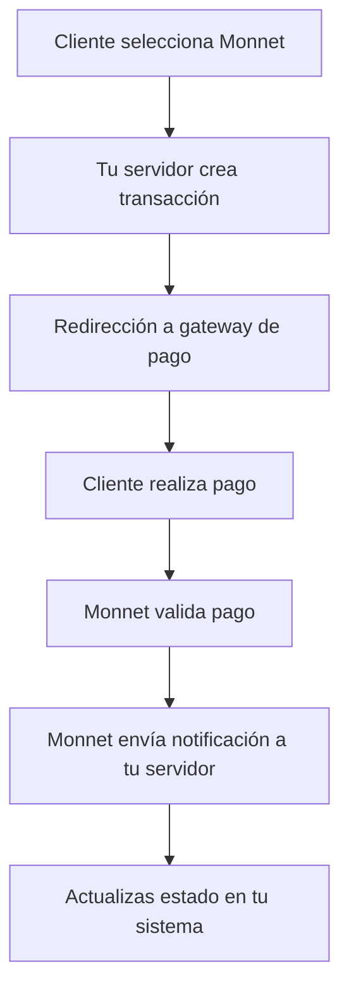

# Guía Completa de Implementación de Monnet Payments API

¡Bienvenido a la guía completa para implementar la API de Monnet Payments en tu proyecto! Esta guía está diseñada específicamente para desarrolladores full stack web como tú, y te proporcionará toda la información necesaria para integrar los servicios de pago de Monnet en tu aplicación.

## 📋 Tabla de Contenidos

1. [Introducción a Monnet Payments](#introducción-a-monnet-payments)
2. [Requisitos Previos](#requisitos-previos)
3. [Configuración Inicial](#configuración-inicial)
4. [Autenticación y Credenciales](#autenticación-y-credenciales)
5. [Métodos de Pago Disponibles](#métodos-de-pago-disponibles)
6. [Flujo de Transacción Básico](#flujo-de-transacción-básico)
7. [Implementación de Transacciones](#implementación-de-transacciones)
8. [Manejo de Notificaciones](#manejo-de-notificaciones)
9. [Cuentas Virtuales](#cuentas-virtuales)
10. [Yape One Shot y Yape On File](#yape-one-shot-y-yape-on-file)
11. [Manejo de Errores](#manejo-de-errores)
12. [Pruebas y Certificación](#pruebas-y-certificación)
13. [Pasos para Producción](#pasos-para-producción)
14. [Recursos Adicionales](#recursos-adicionales)

## 1. Introducción a Monnet Payments 🚀

Monnet Payments es una plataforma de intermediación de pagos en línea que ofrece a los consumidores diferentes métodos de pago y a las empresas formas eficientes de realizar pagos masivos. La plataforma está disponible en varios países de Latinoamérica y ofrece múltiples canales de pago:

- Procesamiento de tarjetas locales (crédito y débito)
- Transferencias bancarias
- Pagos móviles
- Puntos para pagos en efectivo

### Países Soportados

| País | Tarjeta de Crédito | Tarjeta de Débito | Transferencia Bancaria | Efectivo |
|------|-------------------|------------------|-----------------------|---------|
| Argentina | ✅ | ✅ | ✅ | ✅ |
| Chile | ✅ | ✅ | ✅ | ✅ |
| Ecuador | ✅ | ✅ | ✅ | ✅ |
| Perú | ✅ | ✅ | ✅ | ✅ |
| México | ✅ | ✅ | ✅ | ✅ |
| Colombia | ✅ | ✅ | ✅ | ✅ |

## 2. Requisitos Previos 🛠️

Antes de comenzar la implementación, asegúrate de tener:

1. **Cuenta de desarrollador en Monnet**: Contacta a tu representante de cuenta para obtener acceso al entorno de pruebas (CERT).
2. **Credenciales de API**: Necesitarás tu `payinMerchantID` y `KeyMonnet` (Signature Key).
3. **Entorno de desarrollo**: 
   - Node.js (v14+), Python (3.8+), PHP (7.4+), Java (8+), o el lenguaje de tu preferencia
   - Herramientas para hacer solicitudes HTTP (Postman, cURL, Axios, etc.)
   - Un servidor web para manejar notificaciones (webhooks)
4. **Conocimientos técnicos**:
   - HTTP/HTTPS
   - JSON
   - Autenticación con firmas (SHA-512, HMAC-SHA512)
   - Manejo de webhooks

## 3. Configuración Inicial 🔧

### Entornos Disponibles

Monnet ofrece dos entornos:

- **CERT (Pruebas)**: `https://cert.payin.api.monnetpayments.com/`
- **PROD (Producción)**: `https://payin.api.monnetpayments.com/`

**Recomendación**: Siempre comienza con el entorno CERT para pruebas y desarrollo.

### Back Office

Accede al Back Office para obtener tus credenciales:
- **CERT**: [https://cert.payin.monnetpayments.com/](https://cert.payin.monnetpayments.com/)
- **PROD**: [https://payin.monnetpayments.com/](https://payin.monnetpayments.com/)

## 4. Autenticación y Credenciales 🔐

### Obtención de Credenciales

1. Inicia sesión en el Back Office de CERT
2. Ve a la sección de perfil
3. Encuentra tus credenciales:
   - `payinMerchantID`: Identificador único de tu comercio
   - `KeyMonnet` (Signature Key): Llave secreta para firmar solicitudes

### Autenticación Estándar

Todas las solicitudes a la API deben incluir una firma SHA-512 en el header `Authorization`:

```
Authorization: SHA512(payinMerchantID + payinMerchantOperationNumber + payinAmount + payinCurrency + KeyMonnet)
```

**Ejemplo en JavaScript/Node.js**:
```javascript
const crypto = require('crypto');

function generateSignature(merchantId, operationNumber, amount, currency, keyMonnet) {
  const stringToHash = merchantId + operationNumber + amount + currency + keyMonnet;
  return crypto.createHash('sha512').update(stringToHash).digest('hex');
}

const signature = generateSignature(
  '999',
  '1234567890',
  '100.00',
  'USD',
  'tu_llave_secreta_aqui'
);
```

### Autenticación para Cuentas Virtuales (HMAC-SHA512)

Para las APIs de cuentas virtuales, se utiliza un esquema diferente:

```
X-Api-Key: tu_api_key_aqui
X-Timestamp: timestamp_unix
X-Signature: HMAC_SHA512(secret-key, timestamp + api-key)
```

**Ejemplo en JavaScript**:
```javascript
const crypto = require('crypto');

function generateHmacSignature(secret, message) {
  return crypto.createHmac('sha512', secret)
    .update(message)
    .digest('hex');
}

const timestamp = Math.floor(Date.now() / 1000);
const message = timestamp + apiKey + referenceId;
const signature = generateHmacSignature(secretKey, message);
```

## 5. Métodos de Pago Disponibles 💳

Monnet soporta múltiples métodos de pago identificados por tags:

| Tag | Descripción | Países |
|-----|-------------|--------|
| TCTD | Tarjetas de Crédito y Débito | AR, CL, MX, PE, CO, EC |
| TC | Solo Tarjeta de Crédito | CL, MX, PE, AR, CO, EC |
| TD | Solo Tarjeta de Débito | CL, MX, PE, AR, CO, EC |
| Cash | Pago en Efectivo | PE, EC, AR, CO, GT |
| BankTransfer | Transferencia Bancaria | PE, EC, MX, CL, AR, CO, GT, BR |
| Wallet | Billeteras Digitales | PE, EC, CO, GT, AR |
| QR | Código QR | PE, CL |
| VA | Cuentas Virtuales | MX, AR, PE |

## 6. Flujo de Transacción Básico 🔄



1. **Cliente selecciona Monnet** como método de pago en tu sitio
2. **Tu backend** crea una transacción en Monnet
3. **Redirección** del cliente al gateway de pago de Monnet
4. **Cliente completa** el pago según el método seleccionado
5. **Monnet valida** el pago con el banco/procesador
6. **Monnet notifica** a tu servidor via webhook
7. **Tu sistema actualiza** el estado del pedido

## 7. Implementación de Transacciones 💻

### Crear una Transacción

**Endpoint**: `POST /api-payin/v3/online-payments`

**Headers requeridos**:
```
Content-Type: application/json
Authorization: Bearer {SHA512_firma}
```

**Cuerpo de la solicitud (JSON)**:
```json
{
  "payinMerchantID": "999",
  "payinAmount": "100.00",
  "payinCurrency": "USD",
  "payinMerchantOperationNumber": "ORD-12345",
  "payinProcessorCode": "TCTD",
  "payinTransactionOKURL": "https://tusitio.com/success",
  "payinTransactionErrorURL": "https://tusitio.com/error",
  "payinVerification": "{firma_SHA512}",
  "payinCustomerTypeDocument": "DNI",
  "payinCustomerDocument": "12345678"
}
```

**Parámetros obligatorios**:
- `payinMerchantID`: Tu ID de comercio
- `payinAmount`: Monto de la transacción (formato: 00000.00)
- `payinCurrency`: Moneda (ISO 4217: USD, PEN, CLP, etc.)
- `payinMerchantOperationNumber`: Referencia única de tu sistema
- `payinProcessorCode`: Método de pago (TCTD, Cash, etc.)
- `payinTransactionOKURL`: URL de éxito
- `payinTransactionErrorURL`: URL de error
- `payinVerification`: Firma SHA-512
- `payinCustomerTypeDocument`: Tipo de documento del cliente
- `payinCustomerDocument`: Número de documento del cliente

### Obtener Estado de una Transacción

**Endpoint**: `POST /ms-experience-payin/merchant/{MID}/operations`

**Headers**:
```
Authorization: SHA256(payinMerchantID + KeyMonnet)
Content-Type: application/json
```

**Cuerpo de la solicitud**:
```json
{
  "payinStartDate": "2024-01-01",
  "payinEndDate": "2024-02-14",
  "payinMerchantOperationNumber": "ORD-12345"
}
```

**Respuesta exitosa**:
```json
{
  "payinMerchantID": "999",
  "operations": [
    {
      "payinStateID": "5",
      "payinState": "AUTORIZADO",
      "payinAmount": "100.00",
      "payinCurrency": "USD",
      "payinMerchantOperationNumber": "ORD-12345",
      "payinID": "0987654321"
    }
  ]
}
```

## 8. Manejo de Notificaciones 🔔

Monnet enviará notificaciones a tu servidor cuando ocurran eventos importantes (pagos completados, errores, etc.).

### Configurar Webhook

1. **Proporciona a Monnet** una URL pública HTTPS que acepte POST
2. **Implementa el endpoint** para recibir y procesar notificaciones
3. **Valida la firma** de la notificación
4. **Responde con HTTP 200** para confirmar recepción

**Ejemplo de notificación**:
```json
{
  "payinStateID": "5",
  "payinState": "Autorizado",
  "payinStatusErrorMessage": "",
  "payinStatusErrorCode": "00",
  "payinMerchantID": "674",
  "payinAmount": "30.0",
  "payinCurrency": "PEN",
  "payinMerchantOperationNumber": "2-2657443175",
  "payinMethod": "Cash",
  "payinVerification": "{firma_SHA512}"
}
```

**Códigos de estado importantes**:
- `1`: Creado
- `2`: Pendiente de pago
- `5`: Autorizado (éxito)
- `6`: Denegado
- `9`: Liquidado

### Validar Notificación

Siempre valida la firma de la notificación:

```javascript
function validateNotification(notification, keyMonnet) {
  const { payinMerchantID, payinMerchantOperationNumber, payinAmount, payinCurrency, payinVerification } = notification;
  
  const expectedSignature = crypto.createHash('sha512')
    .update(payinMerchantID + payinMerchantOperationNumber + payinAmount + payinCurrency + keyMonnet)
    .digest('hex');
  
  return expectedSignature === payinVerification;
}
```

## 9. Cuentas Virtuales 🏦

Las cuentas virtuales permiten a tus clientes hacer transferencias bancarias a una cuenta única asignada a ellos.

### Crear Cuenta Virtual

**Endpoint**: `POST /merchant-payin-accounts/v1/accounts`

**Headers**:
```
X-Api-Key: tu_api_key
X-Timestamp: {timestamp_unix}
X-Signature: {HMAC_SHA512}
X-Account-deposit-mode: OWNER o ANY
```

**Cuerpo de la solicitud**:
```json
{
  "owner": {
    "referenceId": "CLIENTE-12345",
    "type": "PERSON",
    "document": {
      "type": "DNI",
      "number": "12345678"
    },
    "firstName": "Juan",
    "lastName": "Pérez",
    "email": "juan.perez@example.com",
    "phone": {
      "countryCode": "51",
      "number": "987654321"
    }
  },
  "account": {
    "category": "VIRTUAL",
    "type": "CCI",
    "country": "PER",
    "currency": "PEN",
    "name": "juan.perez"
  },
  "metadata": {
    "cliente_id": "12345",
    "plan": "premium"
  }
}
```

**Respuesta exitosa**:
```json
{
  "id": "acc_8af98b8c8a4",
  "status": "ACTIVE",
  "account": {
    "number": "200300310012",
    "type": "CCI",
    "country": "PER",
    "currency": "PEN"
  }
}
```

### Notificaciones de Depósito

Cuando un cliente deposita en una cuenta virtual, Monnet enviará una notificación:

```json
{
  "operationId": "7019283",
  "status": {
    "code": "5",
    "description": "Aprobado"
  },
  "merchantId": "722",
  "amount": "200.00",
  "currency": "PEN",
  "payinMethod": "VA",
  "depositDetails": {
    "account": {
      "id": "acc_8af98b8c8a4",
      "number": "200300310012",
      "name": "juan.perez"
    },
    "owner": {
      "fullName": "Juan Pérez",
      "documentType": "DNI",
      "documentNumber": "12345678"
    }
  }
}
```

## 10. Yape One Shot y Yape On File 📱

### Yape One Shot

Pago único que requiere aprobación del usuario en la app de Yape:

1. Cliente selecciona Yape One Shot
2. Creas transacción en Monnet
3. Monnet genera un deep link
4. Rediriges al cliente a la app de Yape
5. Cliente aprueba el pago
6. Monnet notifica el resultado

**Endpoint**: `POST /api-payin/v3/online-payments` con `payinProcessorCode: "YapeOS"`

### Yape On File (Suscripciones)

Permite cargar pagos recurrentes sin aprobación cada vez:

#### Crear Suscripción

**Endpoint**: `POST /api/v1/subscription`

**Headers**:
```
Authorization: Bearer SHA512(merchantId + type + customerId + processorCode + keyPayin)
```

**Cuerpo**:
```json
{
  "merchantId": 1073741824,
  "subscriptionDetails": {
    "type": "ON_DEMAND",
    "device": "MOBILE",
    "customerId": "992212092",
    "processorCode": "Yape_on_file"
  }
}
```

**Respuesta**:
```json
{
  "subscriptionId": 1073741824,
  "status": "PENDING",
  "deepLink": "https://yape.com.pe/app/checkout/ocp/subscription?id=..."
}
```

#### Cancelar Suscripción

**Endpoint**: `POST /api/v1/subscription/cancel`

**Cuerpo**:
```json
{
  "merchantId": 1073741824,
  "subscriptionDetails": {
    "type": "ON_DEMAND",
    "customerId": "140912518",
    "processorCode": "Yape_on_file"
  }
}
```

## 11. Manejo de Errores ⚠️

### Códigos de Error Comunes

**Errores de creación**:
- `0001`: payinMerchantID no válido
- `0009`: payinMerchantID incorrecto
- `0010`: payinVerification incorrecto
- `0011`: Comercio no habilitado
- `0015`: Formato de monto no válido

**Errores de confirmación de pago**:
- `9001`: Referir al emisor de la tarjeta
- `9012`: Transacción inválida
- `9051`: Fondos insuficientes
- `9054`: Tarjeta expirada
- `9099`: Error genérico

**Errores de cuentas virtuales**:
- `ERR_MISSING_HEADER`: Header requerido faltante
- `ERR_INVALID_SIGNATURE`: Firma inválida
- `ERR_INVALID_DOCUMENT_TYPE`: Tipo de documento no soportado

### Buenas Prácticas

1. **Registra todos los errores** con sus detalles
2. **Implementa reintentos** para errores temporales (5xx)
3. **Notifica al equipo** para errores críticos
4. **Proporciona mensajes amigables** al usuario final
5. **Valida siempre** las firmas de las respuestas

## 12. Pruebas y Certificación 🧪

### Pruebas en Entorno CERT

1. **Prueba todos los flujos**:
   - Transacciones exitosas
   - Transacciones fallidas
   - Notificaciones
   - Cuentas virtuales
   - Suscripciones

2. **Valida los webhooks**:
   - Asegúrate de recibir y procesar correctamente las notificaciones
   - Verifica que respondas con HTTP 200

3. **Prueba con diferentes**:
   - Métodos de pago
   - Montos
   - Monedas
   - Tipos de documentos

### Proceso de Certificación

1. **Completa todas las pruebas** en CERT
2. **Contacta a tu representante** de Monnet
3. **Programa una sesión** de certificación
4. **Un integrador de Monnet** probará tu implementación
5. **Recibirás aprobación** para pasar a producción

## 13. Pasos para Producción 🚀

1. **Completa la certificación** en el entorno CERT
2. **Solicita credenciales** de producción a tu representante
3. **Actualiza tus credenciales** en tu sistema
4. **Cambia los endpoints** de CERT a PROD:
   - API: `https://payin.api.monnetpayments.com/`
   - Back Office: `https://payin.monnetpayments.com/`
5. **Haz pruebas finales** en producción con montos pequeños
6. **Monitorea** las transacciones inicialmente
7. **Escala gradualmente** el volumen de transacciones

## 14. Recursos Adicionales 📚

### Documentación Oficial
- [Documentación API Monnet](https://payinmonnetpayments.readme.io/)
- [Códigos de Estado](status-codes.md)
- [Métodos de Pago](payin-method.md)
- [Códigos de Error](error-codes.md)

### Ejemplos de Código

**Node.js - Crear Transacción**:
```javascript
const axios = require('axios');
const crypto = require('crypto');

async function createTransaction(merchantId, keyMonnet, transactionData) {
  // Generar firma
  const signatureString = merchantId +
    transactionData.payinMerchantOperationNumber +
    transactionData.payinAmount +
    transactionData.payinCurrency +
    keyMonnet;
  
  const payinVerification = crypto.createHash('sha512')
    .update(signatureString)
    .digest('hex');

  // Preparar datos
  const payload = {
    ...transactionData,
    payinVerification
  };

  // Hacer solicitud
  try {
    const response = await axios.post(
      'https://cert.payin.api.monnetpayments.com/api-payin/v3/online-payments',
      payload,
      {
        headers: {
          'Content-Type': 'application/json'
        }
      }
    );
    
    return response.data;
  } catch (error) {
    console.error('Error creating transaction:', error.response?.data || error.message);
    throw error;
  }
}

// Uso
createTransaction('999', 'tu_llave_secreta', {
  payinMerchantID: '999',
  payinAmount: '100.00',
  payinCurrency: 'USD',
  payinMerchantOperationNumber: 'ORD-12345',
  payinProcessorCode: 'TCTD',
  payinTransactionOKURL: 'https://tusitio.com/success',
  payinTransactionErrorURL: 'https://tusitio.com/error',
  payinCustomerTypeDocument: 'DNI',
  payinCustomerDocument: '12345678'
});
```

**PHP - Validar Notificación**:
```php
<?php
function validateNotification($notification, $keyMonnet) {
    $expectedSignature = hash('sha512',
        $notification['payinMerchantID'] .
        $notification['payinMerchantOperationNumber'] .
        $notification['payinAmount'] .
        $notification['payinCurrency'] .
        $keyMonnet
    );
    
    return $expectedSignature === $notification['payinVerification'];
}

// Ejemplo de uso
$notification = json_decode(file_get_contents('php://input'), true);
$isValid = validateNotification($notification, 'tu_llave_secreta');

if ($isValid) {
    // Procesar notificación
    http_response_code(200);
    echo 'OK';
} else {
    http_response_code(400);
    echo 'Invalid signature';
}
?>
```

### Checklist de Implementación

- [ ] Obtener credenciales de CERT
- [ ] Configurar entorno de desarrollo
- [ ] Implementar creación de transacciones
- [ ] Implementar consulta de estado
- [ ] Configurar endpoint para notificaciones
- [ ] Validar firmas de notificaciones
- [ ] Implementar manejo de errores
- [ ] Probar todos los métodos de pago
- [ ] Probar cuentas virtuales (si aplica)
- [ ] Probar suscripciones (si aplica)
- [ ] Documentar flujos de integración
- [ ] Preparar para certificación
- [ ] Completar certificación
- [ ] Obtener credenciales de producción
- [ ] Desplegar a producción
- [ ] Monitorear transacciones iniciales

## 🎯 Consejos Finales

1. **Siempre valida las firmas** en cada solicitud y respuesta
2. **No almacenes** la KeyMonnet en el frontend
3. **Usa HTTPS** para todas las comunicaciones
4. **Implementa logs detallados** para debugging
5. **Prueba exhaustivamente** antes de pasar a producción
6. **Monitorea** las transacciones en producción inicialmente
7. **Mantén actualizada** tu implementación con los cambios de la API

## 📞 Soporte

Si encuentras problemas durante la implementación:
1. Revisa los logs de errores
2. Consulta la documentación oficial
3. Contacta a tu representante de Monnet
4. Proporciona:
   - Tu merchant ID
   - El error específico
   - Logs relevantes
   - Pasos para reproducir

¡Felicitaciones! 🎉 Ahora estás listo para implementar la API de Monnet Payments en tu proyecto. Esta integración te permitirá ofrecer múltiples métodos de pago a tus clientes en Latinoamérica, aumentando tus conversiones y mejorando la experiencia de usuario.

Si tienes alguna pregunta adicional o necesitas ayuda con algún paso específico, no dudes en preguntar. ¡Estoy aquí para ayudarte! 😊