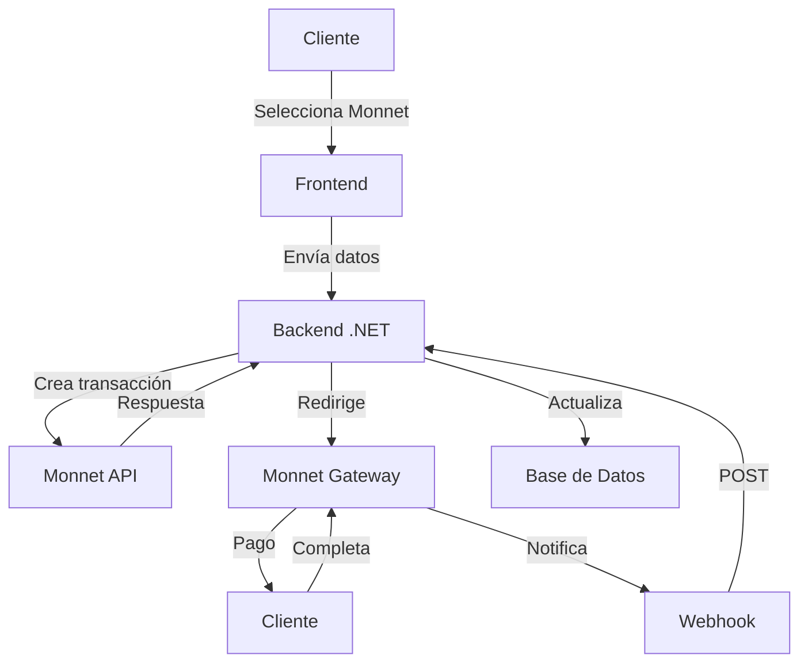

# Implementación de Monnet Payments en .NET 8

## 📋 Parte 2: Transacciones y Controladores

## 5. Modelos de Transacción 📋

### TransactionRequest.cs

Modelo para crear transacciones en Monnet:

```csharp
namespace MonnetPaymentIntegration.Models.Requests
{
    /// <summary>
    /// Modelo para crear transacciones en Monnet
    /// </summary>
    public class TransactionRequest
    {
        /// <summary>
        /// ID del comercio (proporcionado por Monnet)
        /// </summary>
        public string PayinMerchantID { get; set; }

        /// <summary>
        /// Monto de la transacción (formato: 00000.00)
        /// </summary>
        public string PayinAmount { get; set; }

        /// <summary>
        /// Moneda (ISO 4217: USD, PEN, CLP, etc.)
        /// </summary>
        public string PayinCurrency { get; set; }

        /// <summary>
        /// Número de operación único del comercio
        /// </summary>
        public string PayinMerchantOperationNumber { get; set; }

        /// <summary>
        /// Código del procesador (TCTD, Cash, BankTransfer, etc.)
        /// </summary>
        public string PayinProcessorCode { get; set; }

        /// <summary>
        /// URL de éxito (donde redirigir al cliente)
        /// </summary>
        public string PayinTransactionOKURL { get; set; }

        /// <summary>
        /// URL de error (donde redirigir al cliente)
        /// </summary>
        public string PayinTransactionErrorURL { get; set; }

        /// <summary>
        /// Tipo de documento del cliente
        /// </summary>
        public string PayinCustomerTypeDocument { get; set; }

        /// <summary>
        /// Número de documento del cliente
        /// </summary>
        public string PayinCustomerDocument { get; set; }

        /// <summary>
        /// Email del cliente (opcional)
        /// </summary>
        public string PayinCustomerEmail { get; set; }

        /// <summary>
        /// Nombre del cliente (opcional)
        /// </summary>
        public string PayinCustomerName { get; set; }
    }
}
```

### TransactionResponse.cs

Modelos para respuestas de la API:

```csharp
namespace MonnetPaymentIntegration.Models.Responses
{
    /// <summary>
    /// Respuesta de creación de transacción
    /// </summary>
    public class TransactionResponse
    {
        /// <summary>
        /// ID de la transacción en Monnet
        /// </summary>
        public string PayinID { get; set; }

        /// <summary>
        /// URL de redirección para el cliente
        /// </summary>
        public string PayinURL { get; set; }

        /// <summary>
        /// Estado de la transacción
        /// </summary>
        public string Status { get; set; }

        /// <summary>
        /// Mensaje de respuesta
        /// </summary>
        public string Message { get; set; }
    }

    /// <summary>
    /// Respuesta de consulta de estado
    /// </summary>
    public class TransactionStatusResponse
    {
        public string PayinMerchantID { get; set; }
        public List<TransactionOperation> Operations { get; set; }
    }

    /// <summary>
    /// Operación individual
    /// </summary>
    public class TransactionOperation
    {
        public string PayinStateID { get; set; }
        public string PayinState { get; set; }
        public string PayinAmount { get; set; }
        public string PayinCurrency { get; set; }
        public string PayinMerchantOperationNumber { get; set; }
        public string PayinID { get; set; }
    }

    /// <summary>
    /// Respuesta de error
    /// </summary>
    public class ErrorResponse
    {
        public string ErrorCode { get; set; }
        public string ErrorMessage { get; set; }
        public List<ErrorDetail> ErrorDetails { get; set; }
    }

    public class ErrorDetail
    {
        public string Field { get; set; }
        public string Message { get; set; }
    }
}
```

## 6. Servicio de Transacciones 💻

### MonnetTransactionService.cs

Servicio completo para manejo de transacciones:

```csharp
using System.Net.Http.Headers;
using System.Text;
using Newtonsoft.Json;
using Polly;
using Polly.Retry;

namespace MonnetPaymentIntegration.Services
{
    /// <summary>
    /// Servicio para manejo de transacciones con Monnet Payments
    /// </summary>
    public class MonnetTransactionService
    {
        private readonly HttpClient _httpClient;
        private readonly MonnetAuthService _authService;
        private readonly IConfiguration _configuration;
        private readonly ILogger<MonnetTransactionService> _logger;
        private readonly AsyncRetryPolicy _retryPolicy;

        /// <summary>
        /// Constructor
        /// </summary>
        public MonnetTransactionService(
            IHttpClientFactory httpClientFactory,
            MonnetAuthService authService,
            IConfiguration configuration,
            ILogger<MonnetTransactionService> logger)
        {
            _httpClient = httpClientFactory.CreateClient("Monnet");
            _authService = authService;
            _configuration = configuration;
            _logger = logger;

            // Configurar política de reintento con backoff exponencial
            _retryPolicy = Policy
                .Handle<HttpRequestException>()
                .OrResult<HttpResponseMessage>(r => !r.IsSuccessStatusCode)
                .WaitAndRetryAsync(
                    retryCount: _configuration.GetValue<int>("Monnet:MaxRetryAttempts"),
                    sleepDurationProvider: retryAttempt => TimeSpan.FromSeconds(Math.Pow(2, retryAttempt)),
                    onRetry: (response, delay, retryCount, context) => 
                    {
                        _logger.LogWarning(
                            "Intento {RetryCount} fallido. Reintentando en {Delay} segundos...",
                            retryCount,
                            delay.TotalSeconds);
                    });
        }

        /// <summary>
        /// Crea una nueva transacción en Monnet
        /// </summary>
        /// <param name="request">Datos de la transacción</param>
        /// <returns>Respuesta con detalles de la transacción</returns>
        public async Task<TransactionResponse> CreateTransactionAsync(TransactionRequest request)
        {
            try
            {
                // Validar request
                if (request == null)
                    throw new ArgumentNullException(nameof(request));

                if (string.IsNullOrEmpty(request.PayinMerchantOperationNumber))
                    throw new ArgumentException("Operation number is required");

                // Generar firma
                string signature = _authService.GenerateStandardSignature(
                    request.PayinMerchantOperationNumber,
                    request.PayinAmount,
                    request.PayinCurrency);

                // Preparar payload
                var payload = new
                {
                    request.PayinMerchantID,
                    request.PayinAmount,
                    request.PayinCurrency,
                    request.PayinMerchantOperationNumber,
                    request.PayinProcessorCode,
                    request.PayinTransactionOKURL,
                    request.PayinTransactionErrorURL,
                    PayinVerification = signature,
                    request.PayinCustomerTypeDocument,
                    request.PayinCustomerDocument,
                    request.PayinCustomerEmail,
                    request.PayinCustomerName
                };

                _logger.LogInformation(
                    "Creando transacción {OperationNumber} por {Amount} {Currency}",
                    request.PayinMerchantOperationNumber,
                    request.PayinAmount,
                    request.PayinCurrency);

                // Enviar solicitud con reintento
                var response = await _retryPolicy.ExecuteAsync(() =>
                    _httpClient.PostAsync(
                        "/api-payin/v3/online-payments",
                        new StringContent(
                            JsonConvert.SerializeObject(payload),
                            Encoding.UTF8,
                            "application/json")));

                response.EnsureSuccessStatusCode();

                var responseContent = await response.Content.ReadAsStringAsync();
                _logger.LogDebug("Respuesta de Monnet: {Response}", responseContent);

                return JsonConvert.DeserializeObject<TransactionResponse>(responseContent);
            }
            catch (HttpRequestException httpEx)
            {
                _logger.LogError(httpEx, "Error al crear transacción en Monnet");
                throw new Exception("Error de comunicación con Monnet", httpEx);
            }
            catch (JsonException jsonEx)
            {
                _logger.LogError(jsonEx, "Error al parsear respuesta de Monnet");
                throw new Exception("Error al procesar respuesta de Monnet", jsonEx);
            }
            catch (Exception ex)
            {
                _logger.LogError(ex, "Error inesperado al crear transacción");
                throw;
            }
        }

        /// <summary>
        /// Consulta el estado de una transacción
        /// </summary>
        /// <param name="operationNumber">Número de operación</param>
        /// <param name="startDate">Fecha de inicio (opcional)</param>
        /// <param name="endDate">Fecha fin (opcional)</param>
        /// <returns>Estado de la transacción</returns>
        public async Task<TransactionStatusResponse> GetTransactionStatusAsync(
            string operationNumber,
            DateTime? startDate = null,
            DateTime? endDate = null)
        {
            try
            {
                if (string.IsNullOrEmpty(operationNumber))
                    throw new ArgumentException("Operation number is required");

                var payload = new
                {
                    payinStartDate = startDate?.ToString("yyyy-MM-dd"),
                    payinEndDate = endDate?.ToString("yyyy-MM-dd"),
                    payinMerchantOperationNumber = operationNumber
                };

                // Generar firma para header
                string authHeader = _authService.GenerateStandardSignature(
                    operationNumber, "0", "USD");

                var request = new HttpRequestMessage(HttpMethod.Post, 
                    $"/ms-experience-payin/merchant/{_authService.MerchantId}/operations")
                {
                    Content = new StringContent(
                        JsonConvert.SerializeObject(payload),
                        Encoding.UTF8,
                        "application/json")
                };

                request.Headers.Add("Authorization", authHeader);

                _logger.LogInformation(
                    "Consultando estado de transacción {OperationNumber}",
                    operationNumber);

                var response = await _retryPolicy.ExecuteAsync(() =>
                    _httpClient.SendAsync(request));

                response.EnsureSuccessStatusCode();

                var responseContent = await response.Content.ReadAsStringAsync();
                return JsonConvert.DeserializeObject<TransactionStatusResponse>(responseContent);
            }
            catch (Exception ex)
            {
                _logger.LogError(ex, "Error al consultar estado de transacción {OperationNumber}", operationNumber);
                throw;
            }
        }

        /// <summary>
        /// Obtiene todos los métodos de pago disponibles
        /// </summary>
        /// <returns>Lista de métodos de pago</returns>
        public async Task<List<PaymentMethod>> GetAvailablePaymentMethodsAsync()
        {
            // Implementación para obtener métodos de pago
            return new List<PaymentMethod>
            {
                new PaymentMethod { Code = "TCTD", Name = "Tarjetas Crédito/Débito" },
                new PaymentMethod { Code = "Cash", Name = "Efectivo" },
                new PaymentMethod { Code = "BankTransfer", Name = "Transferencia Bancaria" },
                new PaymentMethod { Code = "VA", Name = "Cuentas Virtuales" }
            };
        }
    }

    /// <summary>
    /// Modelo para métodos de pago
    /// </summary>
    public class PaymentMethod
    {
        public string Code { get; set; }
        public string Name { get; set; }
        public List<string> AvailableCountries { get; set; }
    }
}
```

### Uso del servicio de transacciones

```csharp
// Inyectar en tu controlador
private readonly MonnetTransactionService _transactionService;

public MonnetController(MonnetTransactionService transactionService)
{
    _transactionService = transactionService;
}

// Crear transacción
var request = new TransactionRequest
{
    PayinMerchantID = "999999",
    PayinAmount = "100.00",
    PayinCurrency = "PEN",
    PayinMerchantOperationNumber = "ORD-12345",
    PayinProcessorCode = "TCTD",
    PayinTransactionOKURL = "https://tusitio.com/success",
    PayinTransactionErrorURL = "https://tusitio.com/error",
    PayinCustomerTypeDocument = "DNI",
    PayinCustomerDocument = "12345678"
};

var response = await _transactionService.CreateTransactionAsync(request);

// Consultar estado
var status = await _transactionService.GetTransactionStatusAsync("ORD-12345");
```

## 7. Controladores 🎛️

### MonnetController.cs

Controlador para manejo de transacciones:

```csharp
using Microsoft.AspNetCore.Mvc;
using Newtonsoft.Json;

namespace MonnetPaymentIntegration.Controllers
{
    [ApiController]
    [Route("api/[controller]")]
    public class MonnetController : ControllerBase
    {
        private readonly MonnetTransactionService _transactionService;
        private readonly ILogger<MonnetController> _logger;

        public MonnetController(
            MonnetTransactionService transactionService,
            ILogger<MonnetController> logger)
        {
            _transactionService = transactionService;
            _logger = logger;
        }

        /// <summary>
        /// Crea una nueva transacción en Monnet
        /// </summary>
        /// <param name="request">Datos de la transacción</param>
        /// <returns>URL de redirección para el cliente</returns>
        [HttpPost("create-transaction")]
        [ProducesResponseType(typeof(TransactionResponse), 200)]
        [ProducesResponseType(400)]
        [ProducesResponseType(500)]
        public async Task<IActionResult> CreateTransaction([FromBody] TransactionRequest request)
        {
            try
            {
                if (!ModelState.IsValid)
                    return BadRequest(ModelState);

                // Validar datos básicos
                if (string.IsNullOrEmpty(request.PayinMerchantOperationNumber))
                    return BadRequest("Operation number is required");

                if (decimal.Parse(request.PayinAmount) <= 0)
                    return BadRequest("Amount must be greater than zero");

                // Crear transacción
                var response = await _transactionService.CreateTransactionAsync(request);

                _logger.LogInformation(
                    "Transacción creada exitosamente: {OperationNumber}",
                    request.PayinMerchantOperationNumber);

                return Ok(new
                {
                    Success = true,
                    RedirectUrl = response.PayinURL,
                    TransactionId = response.PayinID,
                    Message = "Transacción creada exitosamente"
                });
            }
            catch (ArgumentException argEx)
            {
                _logger.LogWarning(argEx, "Error de validación en creación de transacción");
                return BadRequest(new { Success = false, Message = argEx.Message });
            }
            catch (Exception ex)
            {
                _logger.LogError(ex, "Error al crear transacción");
                return StatusCode(500, new { Success = false, Message = "Error interno al procesar la transacción" });
            }
        }

        /// <summary>
        /// Consulta el estado de una transacción
        /// </summary>
        /// <param name="operationNumber">Número de operación</param>
        /// <returns>Estado de la transacción</returns>
        [HttpGet("transaction-status/{operationNumber}")]
        [ProducesResponseType(typeof(TransactionStatusResponse), 200)]
        [ProducesResponseType(404)]
        [ProducesResponseType(500)]
        public async Task<IActionResult> GetTransactionStatus(string operationNumber)
        {
            try
            {
                if (string.IsNullOrEmpty(operationNumber))
                    return BadRequest("Operation number is required");

                var response = await _transactionService.GetTransactionStatusAsync(operationNumber);

                if (response.Operations == null || !response.Operations.Any())
                    return NotFound(new { Success = false, Message = "Transacción no encontrada" });

                return Ok(response);
            }
            catch (Exception ex)
            {
                _logger.LogError(ex, "Error al consultar estado de transacción {OperationNumber}", operationNumber);
                return StatusCode(500, new { Success = false, Message = "Error al consultar estado" });
            }
        }

        /// <summary>
        /// Obtiene métodos de pago disponibles
        /// </summary>
        /// <returns>Lista de métodos de pago</returns>
        [HttpGet("payment-methods")]
        [ProducesResponseType(typeof(List<PaymentMethod>), 200)]
        public async Task<IActionResult> GetPaymentMethods()
        {
            try
            {
                var methods = await _transactionService.GetAvailablePaymentMethodsAsync();
                return Ok(methods);
            }
            catch (Exception ex)
            {
                _logger.LogError(ex, "Error al obtener métodos de pago");
                return StatusCode(500, new { Success = false, Message = "Error al obtener métodos de pago" });
            }
        }
    }
}
```

### Ejemplo de uso del controlador

```csharp
// Request
POST /api/monnet/create-transaction
Content-Type: application/json

{
    "payinMerchantID": "999999",
    "payinAmount": "100.00",
    "payinCurrency": "PEN",
    "payinMerchantOperationNumber": "ORD-12345",
    "payinProcessorCode": "TCTD",
    "payinTransactionOKURL": "https://tusitio.com/success",
    "payinTransactionErrorURL": "https://tusitio.com/error",
    "payinCustomerTypeDocument": "DNI",
    "payinCustomerDocument": "12345678",
    "payinCustomerEmail": "cliente@example.com",
    "payinCustomerName": "Juan Pérez"
}

// Response
{
    "success": true,
    "redirectUrl": "https://gateway.monnet.com/pay?token=abc123",
    "transactionId": "MONNET-98765",
    "message": "Transacción creada exitosamente"
}
```

## 8. Manejo de Webhooks 🔔

### MonnetNotification.cs

Modelo para notificaciones entrantes:

```csharp
namespace MonnetPaymentIntegration.DTOs
{
    /// <summary>
    /// Modelo para notificaciones entrantes de Monnet
    /// </summary>
    public class MonnetNotification
    {
        /// <summary>
        /// ID del estado (1: Creado, 2: Pendiente, 5: Autorizado, 6: Denegado, etc.)
        /// </summary>
        public string PayinStateID { get; set; }

        /// <summary>
        /// Descripción del estado
        /// </summary>
        public string PayinState { get; set; }

        /// <summary>
        /// Mensaje de error (si aplica)
        /// </summary>
        public string PayinStatusErrorMessage { get; set; }

        /// <summary>
        /// Código de error (si aplica)
        /// </summary>
        public string PayinStatusErrorCode { get; set; }

        /// <summary>
        /// ID del comercio
        /// </summary>
        public string PayinMerchantID { get; set; }

        /// <summary>
        /// Monto de la transacción
        /// </summary>
        public string PayinAmount { get; set; }

        /// <summary>
        /// Moneda
        /// </summary>
        public string PayinCurrency { get; set; }

        /// <summary>
        /// Número de operación del comercio
        /// </summary>
        public string PayinMerchantOperationNumber { get; set; }

        /// <summary>
        /// Método de pago utilizado
        /// </summary>
        public string PayinMethod { get; set; }

        /// <summary>
        /// Firma de verificación
        /// </summary>
        public string PayinVerification { get; set; }

        /// <summary>
        /// Información adicional
        /// </summary>
        public List<AdditionalInformation> AdditionalInformation { get; set; }

        /// <summary>
        /// Detalles de error
        /// </summary>
        public ErrorDetails ErrorDetails { get; set; }

        /// <summary>
        /// Código de error de transacción
        /// </summary>
        public string CodeErrorTrx { get; set; }

        /// <summary>
        /// Mensaje de error de transacción
        /// </summary>
        public string MessageErrorTrx { get; set; }
    }

    public class AdditionalInformation
    {
        public string Key { get; set; }
        public string Value { get; set; }
    }

    public class ErrorDetails
    {
        public string CodeErrorTrx { get; set; }
        public string MessageErrorTrx { get; set; }
    }
}
```

### WebhookController.cs

Controlador para manejar notificaciones:

```csharp
using Microsoft.AspNetCore.Mvc;
using Newtonsoft.Json;

namespace MonnetPaymentIntegration.Controllers
{
    [ApiController]
    [Route("api/[controller]")]
    public class WebhookController : ControllerBase
    {
        private readonly MonnetAuthService _authService;
        private readonly ILogger<WebhookController> _logger;

        public WebhookController(
            MonnetAuthService authService,
            ILogger<WebhookController> logger)
        {
            _authService = authService;
            _logger = logger;
        }

        /// <summary>
        /// Endpoint para recibir notificaciones de Monnet
        /// </summary>
        /// <param name="notification">Datos de la notificación</param>
        /// <returns>Respuesta 200 si es procesada correctamente</returns>
        [HttpPost("monnet-notification")]
        [ProducesResponseType(200)]
        [ProducesResponseType(400)]
        public async Task<IActionResult> HandleMonnetNotification([FromBody] MonnetNotification notification)
        {
            try
            {
                _logger.LogInformation("Notificación recibida de Monnet: {Notification}", 
                    JsonConvert.SerializeObject(notification));

                // Validar firma
                if (!_authService.ValidateNotification(
                    notification.PayinMerchantID,
                    notification.PayinMerchantOperationNumber,
                    notification.PayinAmount,
                    notification.PayinCurrency,
                    notification.PayinVerification))
                {
                    _logger.LogWarning("Firma de notificación inválida");
                    return BadRequest("Firma inválida");
                }

                // Procesar según el estado
                switch (notification.PayinStateID)
                {
                    case "5": // Autorizado
                        await ProcessSuccessfulPayment(notification);
                        break;
                    case "6": // Denegado
                        await ProcessFailedPayment(notification);
                        break;
                    case "2": // Pendiente
                        await ProcessPendingPayment(notification);
                        break;
                    default:
                        _logger.LogInformation("Estado desconocido: {StateID}", notification.PayinStateID);
                        break;
                }

                return Ok("Notificación procesada correctamente");
            }
            catch (JsonException jsonEx)
            {
                _logger.LogError(jsonEx, "Error al parsear notificación");
                return BadRequest("Formato de notificación inválido");
            }
            catch (Exception ex)
            {
                _logger.LogError(ex, "Error al procesar notificación");
                return StatusCode(500, "Error interno al procesar notificación");
            }
        }

        private async Task ProcessSuccessfulPayment(MonnetNotification notification)
        {
            _logger.LogInformation(
                "Pago exitoso: {OperationNumber} - {Amount} {Currency}",
                notification.PayinMerchantOperationNumber,
                notification.PayinAmount,
                notification.PayinCurrency);

            // Implementar lógica de negocio:
            // 1. Actualizar estado en base de datos
            // 2. Enviar confirmación al cliente
            // 3. Procesar el pedido
            // 4. Enviar notificación interna
        }

        private async Task ProcessFailedPayment(MonnetNotification notification)
        {
            _logger.LogWarning(
                "Pago fallido: {OperationNumber} - {State}: {ErrorMessage}",
                notification.PayinMerchantOperationNumber,
                notification.PayinState,
                notification.MessageErrorTrx ?? "Sin detalles");

            // Implementar lógica de negocio:
            // 1. Actualizar estado a fallido
            // 2. Notificar al cliente
            // 3. Liberar inventario si aplica
        }

        private async Task ProcessPendingPayment(MonnetNotification notification)
        {
            _logger.LogInformation(
                "Pago pendiente: {OperationNumber}",
                notification.PayinMerchantOperationNumber);

            // Implementar lógica de negocio:
            // 1. Actualizar estado a pendiente
            // 2. Notificar al cliente que el pago está en proceso
        }
    }
}
```

### Ejemplo de notificación

```json
POST /api/webhook/monnet-notification
Content-Type: application/json

{
    "payinStateID": "5",
    "payinState": "Autorizado",
    "payinStatusErrorMessage": "",
    "payinStatusErrorCode": "00",
    "payinMerchantID": "999999",
    "payinAmount": "100.00",
    "payinCurrency": "PEN",
    "payinMerchantOperationNumber": "ORD-12345",
    "payinMethod": "TCTD",
    "payinVerification": "a1b2c3d4e5f6...",
    "additionalInformation": [],
    "errorDetails": null,
    "codeErrorTrx": "",
    "messageErrorTrx": ""
}

Respuesta:
HTTP 200 OK
"Notificación procesada correctamente"
```

## 9. Ejemplo de Integración Completa 🎯

### Flujo de integración



### Controlador de Pagos Completo

```csharp
[ApiController]
[Route("api/payments")]
public class PaymentController : ControllerBase
{
    private readonly MonnetTransactionService _transactionService;
    private readonly ILogger<PaymentController> _logger;

    public PaymentController(
        MonnetTransactionService transactionService,
        ILogger<PaymentController> logger)
    {
        _transactionService = transactionService;
        _logger = logger;
    }

    [HttpPost("create")]
    public async Task<IActionResult> CreatePayment([FromBody] PaymentRequest request)
    {
        try
        {
            if (!ModelState.IsValid)
                return BadRequest(ModelState);

            // Crear transacción
            var transactionRequest = new TransactionRequest
            {
                PayinMerchantID = _authService.MerchantId,
                PayinAmount = request.Amount.ToString("F2"),
                PayinCurrency = request.Currency,
                PayinMerchantOperationNumber = request.OrderId,
                PayinProcessorCode = request.PaymentMethod,
                PayinTransactionOKURL = $"{Request.Scheme}://{Request.Host}/payment/success",
                PayinTransactionErrorURL = $"{Request.Scheme}://{Request.Host}/payment/error",
                PayinCustomerTypeDocument = request.DocumentType,
                PayinCustomerDocument = request.DocumentNumber,
                PayinCustomerEmail = request.Email,
                PayinCustomerName = $"{request.FirstName} {request.LastName}"
            };

            var response = await _transactionService.CreateTransactionAsync(transactionRequest);

            return Ok(new {
                Success = true,
                RedirectUrl = response.PayinURL,
                TransactionId = response.PayinID
            });
        }
        catch (Exception ex)
        {
            _logger.LogError(ex, "Error al crear pago");
            return StatusCode(500, new { Error = "Error al procesar el pago" });
        }
    }

    [HttpGet("status/{orderId}")]
    public async Task<IActionResult> GetPaymentStatus(string orderId)
    {
        try
        {
            var status = await _transactionService.GetTransactionStatusAsync(orderId);
            return Ok(status);
        }
        catch (Exception ex)
        {
            _logger.LogError(ex, "Error al consultar estado de pago {OrderId}", orderId);
            return StatusCode(500, new { Error = "Error al consultar estado" });
        }
    }
}
```

## 10. Buenas Prácticas ✅

### Seguridad

1. **Nunca almacenes credenciales** en código o repositorio
2. **Usa variables de entorno** o Azure Key Vault
3. **Valida siempre firmas** de notificaciones
4. **Implementa IP whitelisting** para webhooks
5. **Usa HTTPS** para todas las comunicaciones

### Rendimiento

1. **Implementa caching** para métodos de pago
2. **Políticas de reintento** con backoff exponencial
3. **Optimiza JSON** con Newtonsoft.Json
4. **HttpClientFactory** para conexiones eficientes
5. **Circuit breakers** con Polly

### Mantenibilidad

1. **Documenta con Swagger** todos los endpoints
2. **Logging estructurado** con Serilog
3. **Dependency Injection** para testing
4. **Pruebas unitarias** para servicios críticos
5. **Documentación actualizada** de la API

### Monitoreo

1. **Registra todas las transacciones** con sus estados
2. **Monitorea tiempos de respuesta** de Monnet API
3. **Configura alertas** para errores críticos
4. **Health checks** para servicios de Monnet
5. **Revisa logs regularmente**

## 🎉 Conclusión

En este archivo hemos cubierto:

✅ **Modelos de transacción** completos
✅ **Servicio de transacciones** con manejo de errores
✅ **Controladores REST** para transacciones
✅ **Manejo de webhooks** con validación
✅ **Ejemplos prácticos** de implementación
✅ **Buenas prácticas** para producción

**Próximos pasos:**

1. **Probar en entorno CERT** todas las funcionalidades
2. **Implementar manejo de errores** personalizado
3. **Configurar monitoreo** para producción
4. **Documentar flujos** para el equipo
5. **Preparar para certificación** con Monnet

¿Te gustaría que continúe con el siguiente archivo que cubrirá cuentas virtuales y suscripciones, o prefieres profundizar en algún aspecto de este archivo? 😊