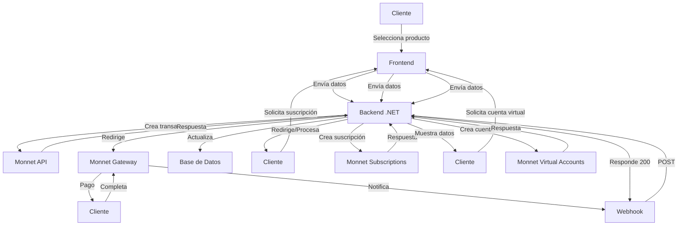

# Implementación de Monnet Payments en .NET 8

## 📋 Parte 3: Cuentas Virtuales y Suscripciones

## 11. Cuentas Virtuales 🏦

### Introducción a Cuentas Virtuales

Las cuentas virtuales de Monnet permiten:

- **Recepción de fondos** mediante transferencias bancarias
- **Cuentas únicas** por cliente
- **Múltiples países** (Argentina, México, Perú)
- **Integración con tu sistema** de usuarios

### Modelos para Cuentas Virtuales

#### VirtualAccountRequest.cs

```csharp
namespace MonnetPaymentIntegration.Models.Requests
{
    /// <summary>
    /// Solicitud para creación de cuenta virtual
    /// </summary>
    public class VirtualAccountRequest
    {
        /// <summary>
        /// Información del propietario de la cuenta
        /// </summary>
        public Owner Owner { get; set; }

        /// <summary>
        /// Información de la cuenta
        /// </summary>
        public Account Account { get; set; }

        /// <summary>
        /// Metadatos adicionales (opcional)
        /// </summary>
        public Dictionary<string, string> Metadata { get; set; }
    }

    /// <summary>
    /// Información del propietario
    /// </summary>
    public class Owner
    {
        /// <summary>
        /// ID de referencia del cliente en tu sistema
        /// </summary>
        public string ReferenceId { get; set; }

        /// <summary>
        /// Tipo de propietario (PERSON o COMPANY)
        /// </summary>
        public string Type { get; set; }

        /// <summary>
        /// Documento de identidad
        /// </summary>
        public Document Document { get; set; }

        /// <summary>
        /// Nombre (requerido para PERSON)
        /// </summary>
        public string FirstName { get; set; }

        /// <summary>
        /// Apellido (requerido para PERSON)
        /// </summary>
        public string LastName { get; set; }

        /// <summary>
        /// Nombre de empresa (requerido para COMPANY)
        /// </summary>
        public string CompanyName { get; set; }

        /// <summary>
        /// Email de contacto
        /// </summary>
        public string Email { get; set; }

        /// <summary>
        /// Teléfono de contacto
        /// </summary>
        public Phone Phone { get; set; }
    }

    /// <summary>
    /// Documento de identidad
    /// </summary>
    public class Document
    {
        /// <summary>
        /// Tipo de documento (DNI, CUIT, RUC, RFC, etc.)
        /// </summary>
        public string Type { get; set; }

        /// <summary>
        /// Número de documento
        /// </summary>
        public string Number { get; set; }
    }

    /// <summary>
    /// Teléfono
    /// </summary>
    public class Phone
    {
        /// <summary>
        /// Código de país
        /// </summary>
        public string CountryCode { get; set; }

        /// <summary>
        /// Número de teléfono
        /// </summary>
        public string Number { get; set; }
    }

    /// <summary>
    /// Información de la cuenta
    /// </summary>
    public class Account
    {
        /// <summary>
        /// Categoría de la cuenta (VIRTUAL)
        /// </summary>
        public string Category { get; set; }

        /// <summary>
        /// Tipo de cuenta (CVU, CCI, CLABE)
        /// </summary>
        public string Type { get; set; }

        /// <summary>
        /// País (ISO 3166-1 alfa-3)
        /// </summary>
        public string Country { get; set; }

        /// <summary>
        /// Moneda (ISO 4217)
        /// </summary>
        public string Currency { get; set; }

        /// <summary>
        /// Nombre de la cuenta (alias)
        /// </summary>
        public string Name { get; set; }
    }
}
```

#### VirtualAccountResponse.cs

```csharp
namespace MonnetPaymentIntegration.Models.Responses
{
    /// <summary>
    /// Respuesta de creación/consulta de cuenta virtual
    /// </summary>
    public class VirtualAccountResponse
    {
        /// <summary>
        /// ID único de la cuenta virtual
        /// </summary>
        public string Id { get; set; }

        /// <summary>
        /// ID de trazabilidad
        /// </summary>
        public string TraceId { get; set; }

        /// <summary>
        /// Fecha y hora de creación
        /// </summary>
        public string Timestamp { get; set; }

        /// <summary>
        /// Estado de la cuenta
        /// </summary>
        public string Status { get; set; }

        /// <summary>
        /// Información del propietario
        /// </summary>
        public Owner Owner { get; set; }

        /// <summary>
        /// Información de la cuenta
        /// </summary>
        public Account Account { get; set; }

        /// <summary>
        /// Metadatos
        /// </summary>
        public Dictionary<string, string> Metadata { get; set; }

        /// <summary>
        /// URL de detalles
        /// </summary>
        public string ResultUrl { get; set; }
    }
}
```

### Servicio de Cuentas Virtuales

#### MonnetVirtualAccountService.cs

```csharp
using System.Net.Http.Headers;
using System.Text;
using Newtonsoft.Json;

namespace MonnetPaymentIntegration.Services
{
    /// <summary>
    /// Servicio para manejo de cuentas virtuales en Monnet
    /// </summary>
    public class MonnetVirtualAccountService
    {
        private readonly HttpClient _httpClient;
        private readonly MonnetAuthService _authService;
        private readonly ILogger<MonnetVirtualAccountService> _logger;

        /// <summary>
        /// Constructor
        /// </summary>
        public MonnetVirtualAccountService(
            IHttpClientFactory httpClientFactory,
            MonnetAuthService authService,
            ILogger<MonnetVirtualAccountService> logger)
        {
            _httpClient = httpClientFactory.CreateClient("MonnetVirtualAccounts");
            _authService = authService;
            _logger = logger;
        }

        /// <summary>
        /// Crea una nueva cuenta virtual
        /// </summary>
        /// <param name="request">Datos de la cuenta virtual</param>
        /// <param name="depositMode">Modo de depósito (OWNER o ANY)</param>
        /// <returns>Respuesta con detalles de la cuenta creada</returns>
        public async Task<VirtualAccountResponse> CreateVirtualAccountAsync(
            VirtualAccountRequest request, string depositMode = "OWNER")
        {
            try
            {
                // Validar request
                if (request == null)
                    throw new ArgumentNullException(nameof(request));

                if (request.Owner == null)
                    throw new ArgumentException("Owner information is required");

                if (request.Account == null)
                    throw new ArgumentException("Account information is required");

                // Validar formato de nombre según país
                ValidateAccountName(request.Account);

                // Generar headers
                var headers = _authService.GenerateVirtualAccountHeaders(request.Owner.ReferenceId);
                headers.Add("X-Account-deposit-mode", depositMode);

                var jsonPayload = JsonConvert.SerializeObject(request);
                var content = new StringContent(jsonPayload, Encoding.UTF8, "application/json");

                // Añadir headers al contenido
                foreach (var header in headers)
                {
                    content.Headers.Add(header.Key, header.Value);
                }

                _logger.LogInformation(
                    "Creando cuenta virtual para {ReferenceId} - {AccountName}",
                    request.Owner.ReferenceId,
                    request.Account.Name);

                var response = await _httpClient.PostAsync("/accounts", content);
                
                var responseContent = await response.Content.ReadAsStringAsync();
                
                if (!response.IsSuccessStatusCode)
                {
                    _logger.LogError("Error al crear cuenta virtual: {Content}", responseContent);
                    throw new Exception("Error al crear cuenta virtual");
                }

                return JsonConvert.DeserializeObject<VirtualAccountResponse>(responseContent);
            }
            catch (Exception ex)
            {
                _logger.LogError(ex, "Error al crear cuenta virtual");
                throw;
            }
        }

        /// <summary>
        /// Obtiene detalles de una cuenta virtual
        /// </summary>
        /// <param name="accountId">ID de la cuenta virtual</param>
        /// <returns>Detalles de la cuenta</returns>
        public async Task<VirtualAccountResponse> GetVirtualAccountAsync(string accountId)
        {
            try
            {
                if (string.IsNullOrEmpty(accountId))
                    throw new ArgumentException("Account ID is required");

                var headers = _authService.GenerateVirtualAccountHeaders();

                var request = new HttpRequestMessage(HttpMethod.Get, $"/accounts?accountId={accountId}");
                foreach (var header in headers)
                {
                    request.Headers.Add(header.Key, header.Value);
                }

                _logger.LogInformation("Consultando cuenta virtual {AccountId}", accountId);

                var response = await _httpClient.SendAsync(request);
                
                var responseContent = await response.Content.ReadAsStringAsync();
                
                if (!response.IsSuccessStatusCode)
                {
                    _logger.LogError("Error al consultar cuenta virtual: {Content}", responseContent);
                    throw new Exception("Error al consultar cuenta virtual");
                }

                return JsonConvert.DeserializeObject<VirtualAccountResponse>(responseContent);
            }
            catch (Exception ex)
            {
                _logger.LogError(ex, "Error al obtener cuenta virtual {AccountId}", accountId);
                throw;
            }
        }

        /// <summary>
        /// Actualiza información de una cuenta virtual
        /// </summary>
        /// <param name="accountId">ID de la cuenta virtual</param>
        /// <param name="updateRequest">Datos a actualizar</param>
        /// <returns>Respuesta con detalles actualizados</returns>
        public async Task<VirtualAccountResponse> UpdateVirtualAccountAsync(
            string accountId, VirtualAccountUpdateRequest updateRequest)
        {
            try
            {
                if (string.IsNullOrEmpty(accountId))
                    throw new ArgumentException("Account ID is required");

                if (updateRequest == null)
                    throw new ArgumentNullException(nameof(updateRequest));

                var headers = _authService.GenerateVirtualAccountHeaders();

                var jsonPayload = JsonConvert.SerializeObject(updateRequest);
                var content = new StringContent(jsonPayload, Encoding.UTF8, "application/json");

                foreach (var header in headers)
                {
                    content.Headers.Add(header.Key, header.Value);
                }

                _logger.LogInformation("Actualizando cuenta virtual {AccountId}", accountId);

                var response = await _httpClient.PatchAsync($"/accounts/{accountId}", content);
                
                var responseContent = await response.Content.ReadAsStringAsync();
                
                if (!response.IsSuccessStatusCode)
                {
                    _logger.LogError("Error al actualizar cuenta virtual: {Content}", responseContent);
                    throw new Exception("Error al actualizar cuenta virtual");
                }

                return JsonConvert.DeserializeObject<VirtualAccountResponse>(responseContent);
            }
            catch (Exception ex)
            {
                _logger.LogError(ex, "Error al actualizar cuenta virtual {AccountId}", accountId);
                throw;
            }
        }

        /// <summary>
        /// Actualiza el estado de una cuenta virtual
        /// </summary>
        /// <param name="accountId">ID de la cuenta virtual</param>
        /// <param name="status">Nuevo estado (ACTIVE, INACTIVE, DELETED)</param>
        /// <param name="reason">Razón del cambio (opcional)</param>
        /// <returns>Respuesta con estado actualizado</returns>
        public async Task<VirtualAccountResponse> UpdateVirtualAccountStatusAsync(
            string accountId, string status, string reason = null)
        {
            try
            {
                if (string.IsNullOrEmpty(accountId))
                    throw new ArgumentException("Account ID is required");

                if (string.IsNullOrEmpty(status))
                    throw new ArgumentException("Status is required");

                var updateRequest = new VirtualAccountStatusUpdateRequest
                {
                    Status = status,
                    Reason = reason
                };

                var headers = _authService.GenerateVirtualAccountHeaders();

                var jsonPayload = JsonConvert.SerializeObject(updateRequest);
                var content = new StringContent(jsonPayload, Encoding.UTF8, "application/json");

                foreach (var header in headers)
                {
                    content.Headers.Add(header.Key, header.Value);
                }

                _logger.LogInformation("Actualizando estado de cuenta virtual {AccountId} a {Status}", accountId, status);

                var response = await _httpClient.PatchAsync($"/accounts/{accountId}/status", content);
                
                var responseContent = await response.Content.ReadAsStringAsync();
                
                if (!response.IsSuccessStatusCode)
                {
                    _logger.LogError("Error al actualizar estado: {Content}", responseContent);
                    throw new Exception("Error al actualizar estado de cuenta virtual");
                }

                return JsonConvert.DeserializeObject<VirtualAccountResponse>(responseContent);
            }
            catch (Exception ex)
            {
                _logger.LogError(ex, "Error al actualizar estado de cuenta virtual {AccountId}", accountId);
                throw;
            }
        }

        /// <summary>
        /// Valida el formato del nombre de cuenta según el país
        /// </summary>
        private void ValidateAccountName(Account account)
        {
            if (string.IsNullOrEmpty(account.Name))
                throw new ArgumentException("Account name is required");

            // Validación para Argentina (CVU)
            if (account.Country == "ARG" && account.Type == "CVU")
            {
                if (!System.Text.RegularExpressions.Regex.IsMatch(account.Name, @"^[a-zA-Z0-9._-]{6,20}$"))
                    throw new ArgumentException("Invalid CVU account name format for Argentina");
            }
            // Validación para México (CLABE)
            else if (account.Country == "MEX" && account.Type == "CLABE")
            {
                if (!System.Text.RegularExpressions.Regex.IsMatch(account.Name, @"^[A-Za-z]{1,9} [A-Za-z]{1,10}$"))
                    throw new ArgumentException("Invalid CLABE account name format for Mexico. Must be two words separated by space");
            }
            // Validación para Perú (CCI)
            else if (account.Country == "PER" && account.Type == "CCI")
            {
                if (!System.Text.RegularExpressions.Regex.IsMatch(account.Name, @"^[a-zA-Z0-9._-]{3,20}$"))
                    throw new ArgumentException("Invalid CCI account name format for Peru");
            }
        }
    }

    /// <summary>
    /// Request para actualización de cuenta virtual
    /// </summary>
    public class VirtualAccountUpdateRequest
    {
        public OwnerUpdate Owner { get; set; }
        public AccountUpdate Account { get; set; }
    }

    /// <summary>
    /// Información de propietario para actualización
    /// </summary>
    public class OwnerUpdate
    {
        public string Email { get; set; }
        public Phone Phone { get; set; }
    }

    /// <summary>
    /// Información de cuenta para actualización
    /// </summary>
    public class AccountUpdate
    {
        public string Name { get; set; }
    }

    /// <summary>
    /// Request para actualización de estado
    /// </summary>
    public class VirtualAccountStatusUpdateRequest
    {
        public string Status { get; set; }
        public string Reason { get; set; }
    }
}

## 12. Suscripciones con Yape On File 📱

### Introducción a Yape On File

Yape On File permite:

- **Pagos recurrentes** sin aprobación cada vez
- **Suscripciones** para servicios continuos
- **Pagos bajo demanda** con consentimiento previo
- **Integración con billetera Yape** en Perú

### Tipos de Suscripción

| Tipo | Descripción | Uso típico |
|------|-------------|------------|
| **ON_DEMAND** | Pago único con consentimiento previo | Compras recurrentes no programadas |
| **RECURRENT** | Pago automático programado | Suscripciones mensuales |

### Modelos para Suscripciones

#### SubscriptionRequest.cs

```csharp
namespace MonnetPaymentIntegration.Models.Requests
{
    /// <summary>
    /// Solicitud para creación de suscripción
    /// </summary>
    public class SubscriptionRequest
    {
        /// <summary>
        /// ID del comercio
        /// </summary>
        public long MerchantId { get; set; }

        /// <summary>
        /// Detalles de la suscripción
        /// </summary>
        public SubscriptionDetails SubscriptionDetails { get; set; }

        /// <summary>
        /// Metadatos adicionales (opcional)
        /// </summary>
        public List<MetadataItem> Metadata { get; set; }
    }

    /// <summary>
    /// Detalles de la suscripción
    /// </summary>
    public class SubscriptionDetails
    {
        /// <summary>
        /// Tipo de suscripción (ON_DEMAND o RECURRENT)
        /// </summary>
        public string Type { get; set; }

        /// <summary>
        /// Dispositivo de origen (MOBILE o WEB)
        /// </summary>
        public string Device { get; set; }

        /// <summary>
        /// ID del cliente (número de teléfono para Yape)
        /// </summary>
        public string CustomerId { get; set; }

        /// <summary>
        /// Código del procesador (Yape_on_file)
        /// </summary>
        public string ProcessorCode { get; set; }

        /// <summary>
        /// Periodicidad para suscripciones recurrentes (en meses)
        /// </summary>
        public string Periodicity { get; set; }

        /// <summary>
        /// Monto para suscripciones recurrentes
        /// </summary>
        public decimal? Amount { get; set; }
    }

    /// <summary>
    /// Item de metadatos
    /// </summary>
    public class MetadataItem
    {
        /// <summary>
        /// Clave del metadato (máx 20 caracteres)
        /// </summary>
        public string Key { get; set; }

        /// <summary>
        /// Valor del metadato (máx 100 caracteres)
        /// </summary>
        public string Value { get; set; }
    }
}
```

#### SubscriptionResponse.cs

```csharp
namespace MonnetPaymentIntegration.Models.Responses
{
    /// <summary>
    /// Respuesta de creación de suscripción
    /// </summary>
    public class SubscriptionResponse
    {
        /// <summary>
        /// ID único de la suscripción
        /// </summary>
        public long SubscriptionId { get; set; }

        /// <summary>
        /// Estado de la suscripción
        /// </summary>
        public string Status { get; set; }

        /// <summary>
        /// Deep link para autorización (solo para MOBILE)
        /// </summary>
        public string DeepLink { get; set; }
    }

    /// <summary>
    /// Respuesta de cancelación de suscripción
    /// </summary>
    public class SubscriptionCancelResponse
    {
        /// <summary>
        /// ID de la suscripción cancelada
        /// </summary>
        public long SubscriptionId { get; set; }

        /// <summary>
        /// Estado final
        /// </summary>
        public string Status { get; set; }
    }

    /// <summary>
    /// Notificación de suscripción
    /// </summary>
    public class SubscriptionNotification
    {
        /// <summary>
        /// ID de la suscripción
        /// </summary>
        public long SubscriptionId { get; set; }

        /// <summary>
        /// Tipo de carga (ON_DEMAND o RECURRENT)
        /// </summary>
        public string ChargeType { get; set; }

        /// <summary>
        /// ID del cliente
        /// </summary>
        public string CustomerId { get; set; }

        /// <summary>
        /// Tipo de origen (WEB o MOBILE)
        /// </summary>
        public string OriginType { get; set; }

        /// <summary>
        /// Estado de la suscripción
        /// </summary>
        public string Status { get; set; }

        /// <summary>
        /// Descripción del estado
        /// </summary>
        public string StatusDescription { get; set; }

        /// <summary>
        /// Detalles de error (si aplica)
        /// </summary>
        public ErrorDetails ErrorDetails { get; set; }

        /// <summary>
        /// Metadatos
        /// </summary>
        public List<MetadataItem> Metadata { get; set; }
    }
}
```

### Servicio de Suscripciones

#### MonnetSubscriptionService.cs

```csharp
using System.Net.Http.Headers;
using System.Text;
using Newtonsoft.Json;

namespace MonnetPaymentIntegration.Services
{
    /// <summary>
    /// Servicio para manejo de suscripciones con Yape On File
    /// </summary>
    public class MonnetSubscriptionService
    {
        private readonly HttpClient _httpClient;
        private readonly MonnetAuthService _authService;
        private readonly ILogger<MonnetSubscriptionService> _logger;

        /// <summary>
        /// Constructor
        /// </summary>
        public MonnetSubscriptionService(
            IHttpClientFactory httpClientFactory,
            MonnetAuthService authService,
            ILogger<MonnetSubscriptionService> logger)
        {
            _httpClient = httpClientFactory.CreateClient("MonnetSubscriptions");
            _authService = authService;
            _logger = logger;
        }

        /// <summary>
        /// Genera header de autorización para suscripciones
        /// </summary>
        private string GenerateSubscriptionAuthHeader(SubscriptionRequest request)
        {
            string message = $"{request.MerchantId}{request.SubscriptionDetails.Type}" +
                           $"{request.SubscriptionDetails.CustomerId}{request.SubscriptionDetails.ProcessorCode}" +
                           _authService.KeyMonnet;

            using var sha512 = System.Security.Cryptography.SHA512.Create();
            byte[] bytes = sha512.ComputeHash(Encoding.UTF8.GetBytes(message));
            return BitConverter.ToString(bytes).Replace("-", "").ToLower();
        }

        /// <summary>
        /// Crea una nueva suscripción
        /// </summary>
        /// <param name="request">Datos de la suscripción</param>
        /// <returns>Respuesta con detalles de la suscripción</returns>
        public async Task<SubscriptionResponse> CreateSubscriptionAsync(SubscriptionRequest request)
        {
            try
            {
                // Validar request
                if (request == null)
                    throw new ArgumentNullException(nameof(request));

                if (request.SubscriptionDetails == null)
                    throw new ArgumentException("Subscription details are required");

                // Validar tipo de suscripción
                if (request.SubscriptionDetails.Type != "ON_DEMAND" && request.SubscriptionDetails.Type != "RECURRENT")
                    throw new ArgumentException("Invalid subscription type. Must be ON_DEMAND or RECURRENT");

                // Validar dispositivo
                if (request.SubscriptionDetails.Device != "MOBILE" && request.SubscriptionDetails.Device != "WEB")
                    throw new ArgumentException("Invalid device type. Must be MOBILE or WEB");

                // Validar periodicidad para recurrentes
                if (request.SubscriptionDetails.Type == "RECURRENT")
                {
                    if (string.IsNullOrEmpty(request.SubscriptionDetails.Periodicity))
                        throw new ArgumentException("Periodicity is required for RECURRENT subscriptions");

                    if (!request.SubscriptionDetails.Amount.HasValue || request.SubscriptionDetails.Amount.Value <= 0)
                        throw new ArgumentException("Amount is required and must be greater than zero for RECURRENT subscriptions");
                }

                // Generar header de autorización
                string authHeader = GenerateSubscriptionAuthHeader(request);

                var jsonPayload = JsonConvert.SerializeObject(request);
                var content = new StringContent(jsonPayload, Encoding.UTF8, "application/json");
                content.Headers.Add("Authorization", $"Bearer {authHeader}");

                _logger.LogInformation(
                    "Creando suscripción {Type} para cliente {CustomerId}",
                    request.SubscriptionDetails.Type,
                    request.SubscriptionDetails.CustomerId);

                var response = await _httpClient.PostAsync("/subscription", content);
                
                var responseContent = await response.Content.ReadAsStringAsync();
                
                if (!response.IsSuccessStatusCode)
                {
                    _logger.LogError("Error al crear suscripción: {Content}", responseContent);
                    throw new Exception("Error al crear suscripción");
                }

                return JsonConvert.DeserializeObject<SubscriptionResponse>(responseContent);
            }
            catch (Exception ex)
            {
                _logger.LogError(ex, "Error al crear suscripción");
                throw;
            }
        }

        /// <summary>
        /// Cancela una suscripción existente
        /// </summary>
        /// <param name="request">Datos de cancelación</param>
        /// <returns>Respuesta de cancelación</returns>
        public async Task<SubscriptionCancelResponse> CancelSubscriptionAsync(SubscriptionCancelRequest request)
        {
            try
            {
                // Validar request
                if (request == null)
                    throw new ArgumentNullException(nameof(request));

                if (request.SubscriptionId <= 0)
                    throw new ArgumentException("Subscription ID is required");

                // Crear request para generar firma
                var tempRequest = new SubscriptionRequest
                {
                    MerchantId = request.MerchantId,
                    SubscriptionDetails = new SubscriptionDetails
                    {
                        Type = request.Type,
                        CustomerId = request.CustomerId,
                        ProcessorCode = request.ProcessorCode
                    }
                };

                // Generar header de autorización
                string authHeader = GenerateSubscriptionAuthHeader(tempRequest);

                var jsonPayload = JsonConvert.SerializeObject(request);
                var content = new StringContent(jsonPayload, Encoding.UTF8, "application/json");
                content.Headers.Add("Authorization", $"Bearer {authHeader}");

                _logger.LogInformation(
                    "Cancelando suscripción {SubscriptionId}",
                    request.SubscriptionId);

                var response = await _httpClient.PostAsync($"/subscription/cancel/{request.SubscriptionId}", content);
                
                var responseContent = await response.Content.ReadAsStringAsync();
                
                if (!response.IsSuccessStatusCode)
                {
                    _logger.LogError("Error al cancelar suscripción: {Content}", responseContent);
                    throw new Exception("Error al cancelar suscripción");
                }

                return JsonConvert.DeserializeObject<SubscriptionCancelResponse>(responseContent);
            }
            catch (Exception ex)
            {
                _logger.LogError(ex, "Error al cancelar suscripción");
                throw;
            }
        }

        /// <summary>
        /// Obtiene detalles de una suscripción
        /// </summary>
        /// <param name="subscriptionId">ID de la suscripción</param>
        /// <returns>Detalles de la suscripción</returns>
        public async Task<SubscriptionResponse> GetSubscriptionAsync(long subscriptionId)
        {
            try
            {
                if (subscriptionId <= 0)
                    throw new ArgumentException("Subscription ID is required");

                _logger.LogInformation("Consultando suscripción {SubscriptionId}", subscriptionId);

                var response = await _httpClient.GetAsync($"/subscription/{subscriptionId}");
                
                var responseContent = await response.Content.ReadAsStringAsync();
                
                if (!response.IsSuccessStatusCode)
                {
                    _logger.LogError("Error al consultar suscripción: {Content}", responseContent);
                    throw new Exception("Error al consultar suscripción");
                }

                return JsonConvert.DeserializeObject<SubscriptionResponse>(responseContent);
            }
            catch (Exception ex)
            {
                _logger.LogError(ex, "Error al consultar suscripción {SubscriptionId}", subscriptionId);
                throw;
            }
        }
    }

    /// <summary>
    /// Request para cancelación de suscripción
    /// </summary>
    public class SubscriptionCancelRequest
    {
        /// <summary>
        /// ID del comercio
        /// </summary>
        public long MerchantId { get; set; }

        /// <summary>
        /// ID de la suscripción a cancelar
        /// </summary>
        public long SubscriptionId { get; set; }

        /// <summary>
        /// Tipo de suscripción
        /// </summary>
        public string Type { get; set; }

        /// <summary>
        /// ID del cliente
        /// </summary>
        public string CustomerId { get; set; }

        /// <summary>
        /// Código del procesador
        /// </summary>
        public string ProcessorCode { get; set; }
    }
}
```

### Controlador para Suscripciones

#### SubscriptionController.cs

```csharp
using Microsoft.AspNetCore.Mvc;
using Newtonsoft.Json;

namespace MonnetPaymentIntegration.Controllers
{
    [ApiController]
    [Route("api/[controller]")]
    public class SubscriptionController : ControllerBase
    {
        private readonly MonnetSubscriptionService _subscriptionService;
        private readonly ILogger<SubscriptionController> _logger;

        public SubscriptionController(
            MonnetSubscriptionService subscriptionService,
            ILogger<SubscriptionController> logger)
        {
            _subscriptionService = subscriptionService;
            _logger = logger;
        }

        /// <summary>
        /// Crea una nueva suscripción
        /// </summary>
        /// <param name="request">Datos de la suscripción</param>
        /// <returns>Respuesta con detalles de la suscripción</returns>
        [HttpPost("create")]
        [ProducesResponseType(typeof(SubscriptionResponse), 200)]
        [ProducesResponseType(400)]
        [ProducesResponseType(500)]
        public async Task<IActionResult> CreateSubscription([FromBody] SubscriptionRequest request)
        {
            try
            {
                if (!ModelState.IsValid)
                    return BadRequest(ModelState);

                var response = await _subscriptionService.CreateSubscriptionAsync(request);

                _logger.LogInformation(
                    "Suscripción creada: {SubscriptionId} - Estado: {Status}",
                    response.SubscriptionId,
                    response.Status);

                return Ok(new
                {
                    Success = true,
                    SubscriptionId = response.SubscriptionId,
                    Status = response.Status,
                    DeepLink = response.DeepLink,
                    Message = "Suscripción creada exitosamente"
                });
            }
            catch (ArgumentException argEx)
            {
                _logger.LogWarning(argEx, "Error de validación en creación de suscripción");
                return BadRequest(new { Success = false, Message = argEx.Message });
            }
            catch (Exception ex)
            {
                _logger.LogError(ex, "Error al crear suscripción");
                return StatusCode(500, new { Success = false, Message = "Error al crear suscripción" });
            }
        }

        /// <summary>
        /// Cancela una suscripción
        /// </summary>
        /// <param name="request">Datos de cancelación</param>
        /// <returns>Respuesta de cancelación</returns>
        [HttpPost("cancel")]
        [ProducesResponseType(typeof(SubscriptionCancelResponse), 200)]
        [ProducesResponseType(400)]
        [ProducesResponseType(500)]
        public async Task<IActionResult> CancelSubscription([FromBody] SubscriptionCancelRequest request)
        {
            try
            {
                if (!ModelState.IsValid)
                    return BadRequest(ModelState);

                var response = await _subscriptionService.CancelSubscriptionAsync(request);

                _logger.LogInformation(
                    "Suscripción cancelada: {SubscriptionId} - Estado: {Status}",
                    response.SubscriptionId,
                    response.Status);

                return Ok(new
                {
                    Success = true,
                    SubscriptionId = response.SubscriptionId,
                    Status = response.Status,
                    Message = "Suscripción cancelada exitosamente"
                });
            }
            catch (ArgumentException argEx)
            {
                _logger.LogWarning(argEx, "Error de validación en cancelación de suscripción");
                return BadRequest(new { Success = false, Message = argEx.Message });
            }
            catch (Exception ex)
            {
                _logger.LogError(ex, "Error al cancelar suscripción");
                return StatusCode(500, new { Success = false, Message = "Error al cancelar suscripción" });
            }
        }

        /// <summary>
        /// Consulta detalles de una suscripción
        /// </summary>
        /// <param name="subscriptionId">ID de la suscripción</param>
        /// <returns>Detalles de la suscripción</returns>
        [HttpGet("{subscriptionId}")]
        [ProducesResponseType(typeof(SubscriptionResponse), 200)]
        [ProducesResponseType(404)]
        [ProducesResponseType(500)]
        public async Task<IActionResult> GetSubscription(long subscriptionId)
        {
            try
            {
                var response = await _subscriptionService.GetSubscriptionAsync(subscriptionId);
                return Ok(response);
            }
            catch (Exception ex)
            {
                _logger.LogError(ex, "Error al consultar suscripción {SubscriptionId}", subscriptionId);
                return StatusCode(500, new { Success = false, Message = "Error al consultar suscripción" });
            }
        }
    }
}
```

### Ejemplos de Uso

#### Crear Suscripción ON_DEMAND

```csharp
var request = new SubscriptionRequest
{
    MerchantId = 1073741824,
    SubscriptionDetails = new SubscriptionDetails
    {
        Type = "ON_DEMAND",
        Device = "MOBILE",
        CustomerId = "992212092", // Número de teléfono
        ProcessorCode = "Yape_on_file"
    },
    Metadata = new List<MetadataItem>
    {
        new MetadataItem { Key = "CustomerReference", Value = "CLIENTE-12345" }
    }
};

var response = await _subscriptionService.CreateSubscriptionAsync(request);
// response.DeepLink contiene el enlace para autorización
```

#### Crear Suscripción RECURRENT

```csharp
var request = new SubscriptionRequest
{
    MerchantId = 1073741824,
    SubscriptionDetails = new SubscriptionDetails
    {
        Type = "RECURRENT",
        Device = "WEB",
        CustomerId = "992212092",
        ProcessorCode = "Yape_on_file",
        Periodicity = "1", // Mensual
        Amount = 150.00m
    }
};

var response = await _subscriptionService.CreateSubscriptionAsync(request);
```

#### Cancelar Suscripción

```csharp
var cancelRequest = new SubscriptionCancelRequest
{
    MerchantId = 1073741824,
    SubscriptionId = 1073741824,
    Type = "ON_DEMAND",
    CustomerId = "992212092",
    ProcessorCode = "Yape_on_file"
};

var response = await _subscriptionService.CancelSubscriptionAsync(cancelRequest);
```

## 13. Manejo de Errores Avanzado ⚠️

### Excepciones Personalizadas

```csharp
/// <summary>
/// Excepción base para errores de Monnet
/// </summary>
public class MonnetException : Exception
{
    public string ErrorCode { get; }
    public string ErrorDetails { get; }
    public HttpStatusCode? StatusCode { get; }

    public MonnetException(string errorCode, string message, string details = null, HttpStatusCode? statusCode = null)
        : base(message)
    {
        ErrorCode = errorCode;
        ErrorDetails = details;
        StatusCode = statusCode;
    }
}

/// <summary>
/// Error de validación
/// </summary>
public class ValidationException : MonnetException
{
    public ValidationException(string message, string details = null)
        : base("VALIDATION_ERROR", message, details, HttpStatusCode.BadRequest) { }
}

/// <summary>
/// Error de autenticación
/// </summary>
public class AuthenticationException : MonnetException
{
    public AuthenticationException(string message)
        : base("AUTH_ERROR", message, null, HttpStatusCode.Unauthorized) { }
}

/// <summary>
/// Error de pago
/// </summary>
public class PaymentFailedException : MonnetException
{
    public PaymentFailedException(string errorCode, string message)
        : base(errorCode, message, null, HttpStatusCode.PaymentRequired) { }
}

/// <summary>
/// Error de cuenta virtual
/// </summary>
public class VirtualAccountException : MonnetException
{
    public VirtualAccountException(string errorCode, string message)
        : base(errorCode, message, null, HttpStatusCode.BadRequest) { }
}

/// <summary>
/// Error de suscripción
/// </summary>
public class SubscriptionException : MonnetException
{
    public SubscriptionException(string errorCode, string message)
        : base(errorCode, message, null, HttpStatusCode.BadRequest) { }
}
```

### Middleware para Manejo de Errores

```csharp
/// <summary>
/// Middleware para manejo global de errores
/// </summary>
public class ExceptionMiddleware
{
    private readonly RequestDelegate _next;
    private readonly ILogger<ExceptionMiddleware> _logger;

    public ExceptionMiddleware(RequestDelegate next, ILogger<ExceptionMiddleware> logger)
    {
        _next = next;
        _logger = logger;
    }

    public async Task InvokeAsync(HttpContext context)
    {
        try
        {
            await _next(context);
        }
        catch (MonnetException monnetEx)
        {
            _logger.LogError(monnetEx, "Error de Monnet: {ErrorCode}", monnetEx.ErrorCode);
            await HandleMonnetExceptionAsync(context, monnetEx);
        }
        catch (HttpRequestException httpEx)
        {
            _logger.LogError(httpEx, "Error HTTP: {StatusCode}", httpEx.StatusCode);
            await HandleHttpExceptionAsync(context, httpEx);
        }
        catch (JsonException jsonEx)
        {
            _logger.LogError(jsonEx, "Error de serialización JSON");
            await HandleJsonExceptionAsync(context, jsonEx);
        }
        catch (Exception ex)
        {
            _logger.LogError(ex, "Error inesperado");
            await HandleExceptionAsync(context, ex);
        }
    }

    private static Task HandleMonnetExceptionAsync(HttpContext context, MonnetException exception)
    {
        var response = new
        {
            Success = false,
            ErrorCode = exception.ErrorCode,
            Message = exception.Message,
            Details = exception.ErrorDetails
        };

        context.Response.ContentType = "application/json";
        context.Response.StatusCode = (int)(exception.StatusCode ?? HttpStatusCode.InternalServerError);

        return context.Response.WriteAsync(JsonConvert.SerializeObject(response));
    }

    private static Task HandleHttpExceptionAsync(HttpContext context, HttpRequestException exception)
    {
        var response = new
        {
            Success = false,
            ErrorCode = "HTTP_ERROR",
            Message = "Error de comunicación con el servicio",
            StatusCode = (int)exception.StatusCode
        };

        context.Response.ContentType = "application/json";
        context.Response.StatusCode = (int)HttpStatusCode.ServiceUnavailable;

        return context.Response.WriteAsync(JsonConvert.SerializeObject(response));
    }

    private static Task HandleJsonExceptionAsync(HttpContext context, JsonException exception)
    {
        var response = new
        {
            Success = false,
            ErrorCode = "JSON_ERROR",
            Message = "Error al procesar datos JSON"
        };

        context.Response.ContentType = "application/json";
        context.Response.StatusCode = (int)HttpStatusCode.BadRequest;

        return context.Response.WriteAsync(JsonConvert.SerializeObject(response));
    }

    private static Task HandleExceptionAsync(HttpContext context, Exception exception)
    {
        var response = new
        {
            Success = false,
            ErrorCode = "INTERNAL_ERROR",
            Message = "Error interno del servidor"
        };

        context.Response.ContentType = "application/json";
        context.Response.StatusCode = (int)HttpStatusCode.InternalServerError;

        return context.Response.WriteAsync(JsonConvert.SerializeObject(response));
    }
}
```

### Configuración del Middleware

En `Program.cs`:

```csharp
// Agregar antes de app.UseAuthorization()
app.UseMiddleware<ExceptionMiddleware>();
```

### Códigos de Error Comunes

#### Errores de Transacción

| Código | Descripción | Solución |
|--------|-------------|----------|
| `0001` | MerchantID inválido | Verificar credenciales |
| `0009` | MerchantID incorrecto | Verificar configuración |
| `0010` | Firma inválida | Revisar generación de firma |
| `0011` | Comercio no habilitado | Contactar a Monnet |
| `0015` | Formato de monto inválido | Usar formato 00000.00 |

#### Errores de Cuenta Virtual

| Código | Descripción | Solución |
|--------|-------------|----------|
| `ERR_MISSING_HEADER` | Header requerido faltante | Verificar headers |
| `ERR_INVALID_SIGNATURE` | Firma inválida | Revisar generación HMAC |
| `ERR_INVALID_DOCUMENT_TYPE` | Tipo de documento no soportado | Verificar documentación |
| `ERR_INVALID_ACCOUNT_NAME` | Nombre de cuenta inválido | Revisar formato por país |

#### Errores de Suscripción

| Código | Descripción | Solución |
|--------|-------------|----------|
| `B422` | Suscripción ya existe | Verificar estado actual |
| `E401` | No autorizado | Verificar credenciales |
| `B401` | Comercio no existe | Verificar MerchantID |
| `B405` | Suscripción no activa | No se puede cancelar |

## 14. Pruebas y Certificación 🧪

### Estrategia de Pruebas

```csharp
// Ejemplo de pruebas unitarias
public class MonnetTransactionServiceTests
{
    private readonly Mock<IHttpClientFactory> _httpClientFactoryMock;
    private readonly Mock<MonnetAuthService> _authServiceMock;
    private readonly Mock<IConfiguration> _configurationMock;
    private readonly Mock<ILogger<MonnetTransactionService>> _loggerMock;
    private readonly MonnetTransactionService _service;

    public MonnetTransactionServiceTests()
    {
        _httpClientFactoryMock = new Mock<IHttpClientFactory>();
        _authServiceMock = new Mock<MonnetAuthService>();
        _configurationMock = new Mock<IConfiguration>();
        _loggerMock = new Mock<ILogger<MonnetTransactionService>>();

        _configurationMock.Setup(c => c.GetValue<int>("Monnet:MaxRetryAttempts")).Returns(3);

        var httpClient = new HttpClient();
        _httpClientFactoryMock.Setup(f => f.CreateClient("Monnet")).Returns(httpClient);

        _service = new MonnetTransactionService(
            _httpClientFactoryMock.Object,
            _authServiceMock.Object,
            _configurationMock.Object,
            _loggerMock.Object);
    }

    [Fact]
    public async Task CreateTransactionAsync_ValidRequest_ReturnsSuccess()
    {
        // Arrange
        var request = new TransactionRequest
        {
            PayinMerchantID = "999999",
            PayinAmount = "100.00",
            PayinCurrency = "PEN",
            PayinMerchantOperationNumber = "TEST-123",
            PayinProcessorCode = "TCTD",
            PayinTransactionOKURL = "https://test.com/success",
            PayinTransactionErrorURL = "https://test.com/error",
            PayinCustomerTypeDocument = "DNI",
            PayinCustomerDocument = "12345678"
        };

        _authServiceMock.Setup(a => a.GenerateStandardSignature(
            It.IsAny<string>(), It.IsAny<string>(), It.IsAny<string>()))
            .Returns("firma_valida");

        // Configurar HttpClient para devolver respuesta exitosa
        var httpResponse = new HttpResponseMessage(HttpStatusCode.OK)
        {
            Content = new StringContent(JsonConvert.SerializeObject(new TransactionResponse
            {
                PayinID = "MONNET-123",
                PayinURL = "https://gateway.test/pay"
            }))
        };

        // Act
        var result = await _service.CreateTransactionAsync(request);

        // Assert
        Assert.NotNull(result);
        Assert.Equal("MONNET-123", result.PayinID);
        Assert.Equal("https://gateway.test/pay", result.PayinURL);
    }

    [Fact]
    public async Task CreateTransactionAsync_InvalidRequest_ThrowsException()
    {
        // Arrange
        TransactionRequest request = null;

        // Act & Assert
        await Assert.ThrowsAsync<ArgumentNullException>(() => _service.CreateTransactionAsync(request));
    }
}
```

### Pruebas de Integración

```csharp
// Ejemplo de prueba de controlador
public class MonnetControllerTests : IClassFixture<WebApplicationFactory<Program>>
{
    private readonly WebApplicationFactory<Program> _factory;

    public MonnetControllerTests(WebApplicationFactory<Program> factory)
    {
        _factory = factory;
    }

    [Fact]
    public async Task CreateTransaction_ReturnsSuccess()
    {
        // Arrange
        var client = _factory.CreateClient();
        var request = new TransactionRequest
        {
            PayinMerchantID = "999999",
            PayinAmount = "100.00",
            PayinCurrency = "PEN",
            PayinMerchantOperationNumber = "TEST-123",
            PayinProcessorCode = "TCTD",
            PayinTransactionOKURL = "https://test.com/success",
            PayinTransactionErrorURL = "https://test.com/error",
            PayinCustomerTypeDocument = "DNI",
            PayinCustomerDocument = "12345678"
        };

        // Act
        var response = await client.PostAsJsonAsync("/api/monnet/create-transaction", request);

        // Assert
        response.EnsureSuccessStatusCode();
        var result = await response.Content.ReadAsStringAsync();
        Assert.Contains("Success", result);
    }
}
```

### Proceso de Certificación

1. **Completar pruebas** en entorno CERT
2. **Documentar flujos** implementados
3. **Contactar a Monnet** para solicitar certificación
4. **Programar sesión** con integrador de Monnet
5. **Recibir aprobación** para producción

### Checklist para Producción

- [ ] Configurar credenciales de producción
- [ ] Actualizar URLs en appsettings.json
- [ ] Implementar IP whitelisting para webhooks
- [ ] Configurar monitoreo de transacciones
- [ ] Implementar alertas para errores críticos
- [ ] Documentar procedimientos de soporte
- [ ] Capacitar al equipo en manejo de errores

## 15. Ejemplo Completo de Integración 🎯

### Flujo Completo con Todos los Componentes



### Controlador de Pagos Completo

```csharp
[ApiController]
[Route("api/payments")]
public class PaymentsController : ControllerBase
{
    private readonly MonnetTransactionService _transactionService;
    private readonly MonnetVirtualAccountService _virtualAccountService;
    private readonly MonnetSubscriptionService _subscriptionService;
    private readonly ILogger<PaymentsController> _logger;

    public PaymentsController(
        MonnetTransactionService transactionService,
        MonnetVirtualAccountService virtualAccountService,
        MonnetSubscriptionService subscriptionService,
        ILogger<PaymentsController> logger)
    {
        _transactionService = transactionService;
        _virtualAccountService = virtualAccountService;
        _subscriptionService = subscriptionService;
        _logger = logger;
    }

    [HttpPost("transaction")]
    public async Task<IActionResult> CreateTransaction([FromBody] PaymentRequest request)
    {
        try
        {
            var transactionRequest = new TransactionRequest
            {
                PayinMerchantID = _authService.MerchantId,
                PayinAmount = request.Amount.ToString("F2"),
                PayinCurrency = request.Currency,
                PayinMerchantOperationNumber = request.OrderId,
                PayinProcessorCode = request.PaymentMethod,
                PayinTransactionOKURL = $"{Request.Scheme}://{Request.Host}/payment/success",
                PayinTransactionErrorURL = $"{Request.Scheme}://{Request.Host}/payment/error",
                PayinCustomerTypeDocument = request.DocumentType,
                PayinCustomerDocument = request.DocumentNumber,
                PayinCustomerEmail = request.Email,
                PayinCustomerName = $"{request.FirstName} {request.LastName}"
            };

            var response = await _transactionService.CreateTransactionAsync(transactionRequest);
            return Ok(new { RedirectUrl = response.PayinURL });
        }
        catch (Exception ex)
        {
            _logger.LogError(ex, "Error en transacción");
            return StatusCode(500, new { Error = "Error al procesar pago" });
        }
    }

    [HttpPost("virtual-account")]
    public async Task<IActionResult> CreateVirtualAccount([FromBody] VirtualAccountRequest request)
    {
        try
        {
            var response = await _virtualAccountService.CreateVirtualAccountAsync(request);
            return Ok(new 
            {
                AccountNumber = response.Account.Number,
                AccountId = response.Id,
                Status = response.Status
            });
        }
        catch (Exception ex)
        {
            _logger.LogError(ex, "Error en cuenta virtual");
            return StatusCode(500, new { Error = "Error al crear cuenta virtual" });
        }
    }

    [HttpPost("subscription")]
    public async Task<IActionResult> CreateSubscription([FromBody] SubscriptionRequest request)
    {
        try
        {
            var response = await _subscriptionService.CreateSubscriptionAsync(request);
            return Ok(new 
            {
                SubscriptionId = response.SubscriptionId,
                Status = response.Status,
                DeepLink = response.DeepLink
            });
        }
        catch (Exception ex)
        {
            _logger.LogError(ex, "Error en suscripción");
            return StatusCode(500, new { Error = "Error al crear suscripción" });
        }
    }
}
```

## 16. Buenas Prácticas Finales ✅

### Arquitectura

1. **Separación de responsabilidades** en capas claras
2. **Inyección de dependencias** para fácil testing
3. **Patrón Repository** para acceso a datos
4. **CQRS** para operaciones complejas
5. **Event Sourcing** para auditoría

### Seguridad

1. **Nunca expongas credenciales** en logs o respuestas
2. **Usa HTTPS** con certificados válidos
3. **Implementa rate limiting** para evitar abusos
4. **Valida todos los inputs** antes de procesar
5. **Usa Content Security Policy** en frontend

### Rendimiento

1. **Implementa caching** con Redis o MemoryCache
2. **Usa Connection Pooling** para bases de datos
3. **Optimiza consultas** con índices adecuados
4. **Minimiza payloads** en APIs
5. **Usa compression** para respuestas grandes

### DevOps

1. **CI/CD automatizado** para despliegues
2. **Blue-Green Deployment** para cero downtime
3. **Feature Flags** para nuevas funcionalidades
4. **Health Checks** para monitoreo
5. **Canary Releases** para pruebas graduales

### Monitoreo

1. **APM** (Application Performance Monitoring)
2. **Logging centralizado** con ELK Stack
3. **Alertas proactivas** para errores críticos
4. **Dashboards** para métricas clave
5. **Tracing distribuido** para microservicios

## 🎉 Conclusión Final

¡Felicitaciones! Ahora tienes una implementación **completa y profesional** de Monnet Payments en .NET 8 que incluye:

### ✅ Funcionalidades Completa

1. **Transacciones** con múltiples métodos de pago
2. **Cuentas virtuales** para recepción de fondos
3. **Suscripciones** con Yape On File
4. **Webhooks** para notificaciones en tiempo real
5. **Manejo de errores** robusto y profesional
6. **Seguridad** en todas las capas
7. **Rendimiento** optimizado
8. **Documentación** completa

### 🚀 Próximos Pasos

1. **Implementar en tu proyecto** siguiendo esta guía
2. **Probar exhaustivamente** en entorno CERT
3. **Documentar flujos** para tu equipo
4. **Capacitar al equipo** de soporte
5. **Solicitar certificación** con Monnet
6. **Desplegar a producción** con monitoreo
7. **Monitorear y optimizar** continuamente

### 📚 Recursos Adicionales

- [Documentación Oficial de Monnet](https://payinmonnetpayments.readme.io/)
- [Códigos de Estado](https://payinmonnetpayments.readme.io/reference/status-codes)
- [Métodos de Pago](https://payinmonnetpayments.readme.io/reference/payin-method)
- [Códigos de Error](https://payinmonnetpayments.readme.io/reference/error-codes)

Si tienes alguna pregunta adicional o necesitas ayuda con algún aspecto específico de la implementación, no dudes en preguntar. ¡Estoy aquí para ayudarte! 😊

**¡Mucho éxito con tu integración de Monnet Payments en .NET 8!** 🚀